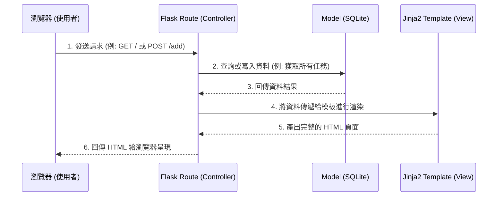

# 系統架構設計文件 (ARCHITECTURE) - 讀書計畫管理系統

## 1. 技術架構說明

本系統為一款專門為學生設計的讀書計畫管理平台，採用傳統的後端渲染 MVC (Model-View-Controller) 架構。所有的資料處理、商業邏輯與畫面生成均由後端統籌，非常適合快速開發與概念驗證。

### 選用技術與原因
- **後端：Python + Flask**
  - **原因**：Flask 輕量、靈活且學習曲線平緩，非常適合用來快速打造 MVP（最小可行性產品）。它能讓我們專注於核心功能的開發，不被繁雜的框架設定綁定。
- **模板引擎：Jinja2**
  - **原因**：內建於 Flask 生態系中，負責將後端動態數據嵌入 HTML 之中。它允許我們在不依賴複雜前端框架（如 React / Vue）的情況下，實作出響應迅速的動態頁面。
- **資料庫：SQLite**
  - **原因**：輕量級且免安裝伺服器軟體的關聯式資料庫，檔案直接存在本機專案資料夾內（`database.db`）。對於讀書計畫管理系統的初始資料量（如任務、狀態）來說已經非常夠用，未來若需要亦可輕鬆移轉至 PostgreSQL 或 MySQL。

### Flask MVC 模式說明
- **Model (模型)**：負責定義資料庫表格（如讀書任務的資料表）與資料存取邏輯。
- **View (視圖)**：負責呈現使用者介面（UI），Jinja2 會讀取 HTML 模板並把資料填入後回傳給瀏覽器。
- **Controller (控制器)**：負責接收使用者的 HTTP 請求（如新增任務、標記完成），呼叫 Model 進行資料庫操作，然後將結果傳給 View 進行渲染。

## 2. 專案資料夾結構

以下為專案建議的資料夾結構，依循 Flask 開發的最佳實踐，將不同職責的檔案明確分開：

```text
web_app_development/
├── app/                    # 應用程式主目錄
│   ├── models/             # [Model] 資料庫模型
│   │   ├── __init__.py
│   │   └── task.py         # 定義讀書任務 (Task) 的 Schema
│   ├── routes/             # [Controller] 處理路由與邏輯
│   │   ├── __init__.py
│   │   └── task_routes.py  # 處理 /tasks 相關的新增、修改、刪除邏輯
│   ├── templates/          # [View] Jinja2 HTML 模板
│   │   ├── base.html       # 共用版面佈局（導覽列、頁尾）
│   │   ├── index.html      # 首頁（包含任務列表與行事曆）
│   │   └── stats.html      # 進度統計頁面
│   └── static/             # 靜態資源檔案
│       ├── css/
│       │   └── style.css   # 客製化樣式表
│       └── js/
│           └── main.js     # 前端互動邏輯（如 AJAX 切換完成狀態）
├── instance/               # 存放不可加入版控的本機資料
│   └── database.db         # SQLite 資料庫檔案
├── docs/                   # 開發文件目錄
│   ├── PRD.md              # 產品需求文件
│   └── ARCHITECTURE.md     # 系統架構文件（本文件）
├── app.py                  # 系統入口檔案，負責啟動 Flask Server
└── requirements.txt        # 紀錄 Python 相依套件清單
```

## 3. 元件關係圖

以下展示當使用者透過瀏覽器操作系統時，各個元件之間如何互動：



## 4. 關鍵設計決策

1. **伺服器端渲染 (SSR)**
   - **決策**：前端畫面由 Flask 搭配 Jinja2 於後端產生 HTML，而非建立獨立的前端 SPA (Single Page Application) 與 RESTful API。
   - **原因**：減少開發初期的架構複雜度，不需要處理跨域問題 (CORS)，且能以最快速度實現 MVP 範圍內的所有功能（如任務清單與狀態標記）。

2. **以單一視圖為主的工作區 (Unified Workspace)**
   - **決策**：在首頁 (`index.html`) 同時呈現「任務新增表單」與「任務列表」。
   - **原因**：讀書計畫管理系統的目標用戶需要快速且高頻次地操作（新增、打勾完成）。將主要功能集中在同一頁面，能最大化減少頁面跳轉的等待感，提升整體使用者體驗。

3. **輕量級的狀態切換機制 (AJAX 結合 SSR)**
   - **決策**：雖然是傳統 SSR 架構，但對於「標記任務完成」這種高頻小動作，我們將使用簡單的 Vanilla JavaScript 搭配 `fetch` API，發送非同步請求到後端更新狀態，而不重新載入整頁。
   - **原因**：若是每次打勾都需要重新載入整頁 HTML，會干擾使用者的閱讀流暢度。透過局部更新狀態能讓系統在保持簡單架構的同時，兼顧敏捷現代的互動體驗。
