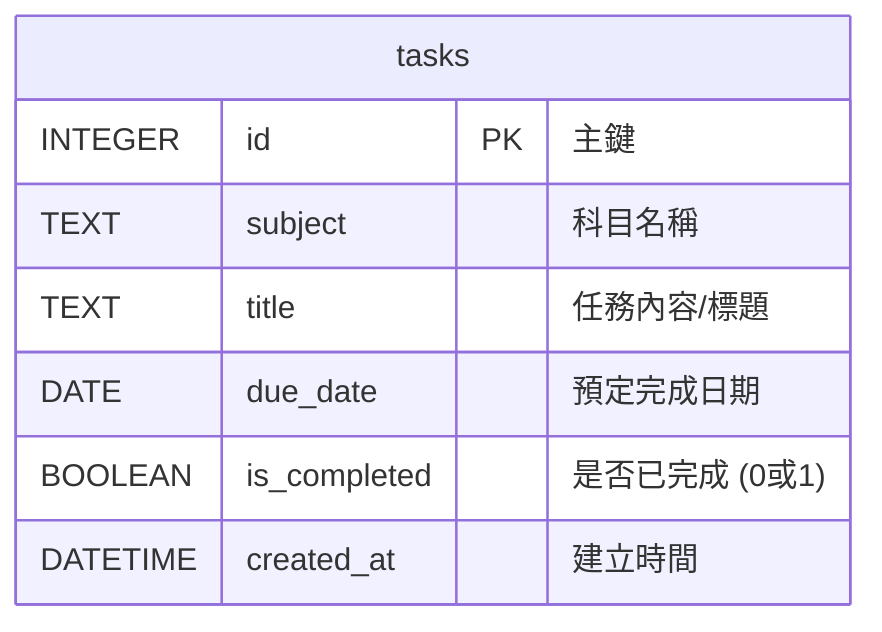

# 資料庫設計文件 (DB DESIGN) - 讀書計畫管理系統

這份文件定義了系統將如何儲存讀書任務與進度狀態，包含實體關係圖 (ERD)、資料表結構說明以及對應的 Python Models。

## 1. 實體關係圖 (ERD)

由於這是一個單用戶的 MVP 系統，目前只需專注在核心的讀書任務表 (`tasks`) 上。

## 2. 資料表詳細說明

### 資料表：`tasks` (讀書任務)
用途：儲存使用者的所有讀書任務及其完成狀態。

| 欄位名稱 | 型別 | 說明 | 約束條件 |
| :--- | :--- | :--- | :--- |
| `id` | INTEGER | 任務唯一識別碼 | PRIMARY KEY, AUTOINCREMENT |
| `subject` | TEXT | 任務所屬的科目 (例：數學、英文) | NOT NULL |
| `title` | TEXT | 具體的讀書內容或標題 | NOT NULL |
| `due_date` | DATE | 預定要完成這項任務的日期 | NOT NULL |
| `is_completed` | INTEGER | 記錄任務是否完成 (SQLite 中 0=False, 1=True) | DEFAULT 0 |
| `created_at` | DATETIME | 紀錄該筆任務被建立的時間 | DEFAULT CURRENT_TIMESTAMP |

## 3. SQL 建表語法

請參考檔案：`database/schema.sql`

## 4. Python Model 實作

我們採用內建的 `sqlite3` 模組撰寫輕量化的 Model 方法，實作了 CRUD 相關操作。
請參考以下檔案：
- `app/models/__init__.py`
- `app/models/task.py`
