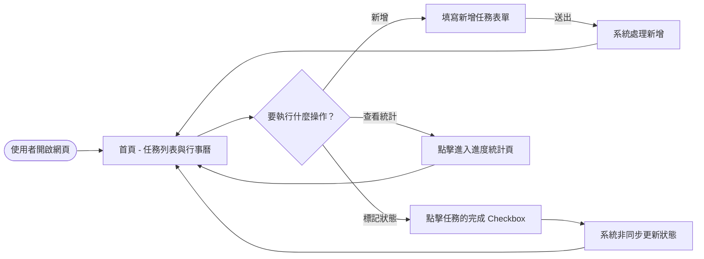
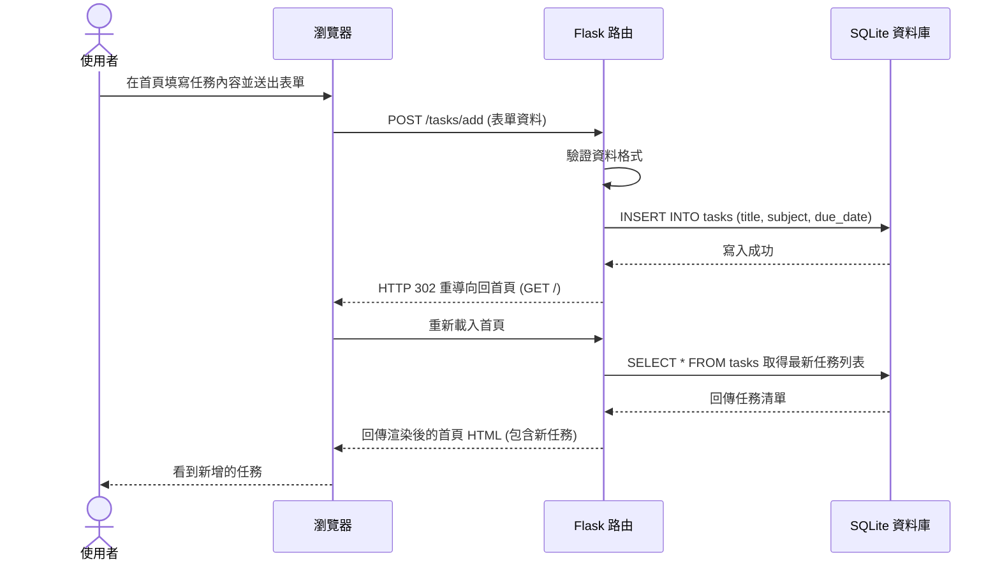

# 流程圖與流程設計 (FLOWCHART) - 讀書計畫管理系統

這份文件視覺化了使用者操作路徑以及系統內的資料流，幫助開發團隊確認每個功能的前後步驟。

## 1. 使用者流程圖（User Flow）

以下流程圖展示了使用者進入「讀書計畫管理系統」後，如何進行各項操作（如新增任務、標記完成、查看進度等）。

## 2. 系統序列圖（Sequence Diagram）

以下序列圖以「使用者新增一筆讀書任務」為例，展示從前端送出表單到後端資料庫存取的完整資料流。

## 3. 功能清單對照表

根據 PRD 定義的核心功能，我們規劃了以下的路由結構：

| 功能名稱 | 網址路徑 (URL) | HTTP 方法 | 說明 |
| :--- | :--- | :--- | :--- |
| **任務列表** | `/` | GET | 顯示首頁，包含所有任務與行事曆檢視 |
| **任務新增** | `/tasks/add` | POST | 接收表單資料並建立新的讀書任務 |
| **完成標記** | `/tasks/<id>/toggle` | POST | 切換特定任務的「已完成/未完成」狀態 |
| **進度統計** | `/stats` | GET | 顯示任務完成比例與整體學習進度統計圖表 |
